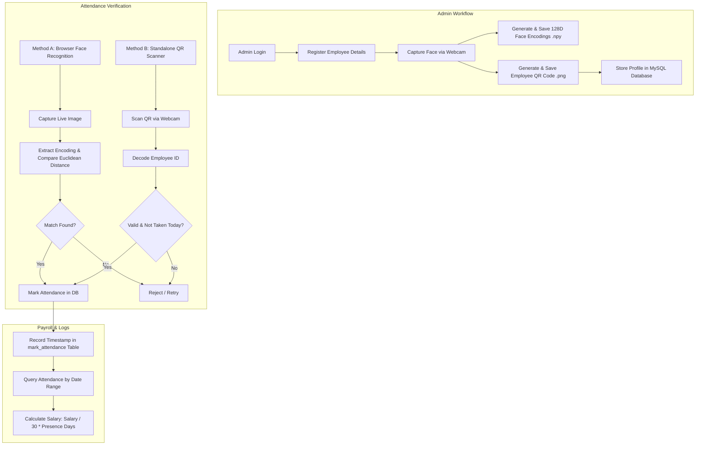

# Employee Attendance System using QR Code & Face Recognition

A comprehensive **Employee Attendance System** built with **Python**, **Django**, **MySQL**, and **Computer Vision** (`OpenCV` & `face_recognition`). The system offers dual attendance verification methods—**QR Code Scanning** and **Facial Recognition**—along with automated attendance tracking, admin employee onboarding, employee self-service dashboards, and pro-rated salary calculation based on presence days.

---

## 🌟 Project Highlights

- **Automated Employee Attendance**: Instant daily attendance recording with duplicate check-in prevention.
- **QR Code Scanning**: Real-time QR code generation upon employee registration and desktop webcam scanning via OpenCV.
- **Facial Recognition**: Advanced 128-dimensional facial biometric encoding and recognition using `face_recognition` and Haar Cascade classifiers.
- **Django Web Backend**: Robust Web application managing authentication, views, dynamic template rendering, and administrative workflows.
- **MySQL Database Integration**: Relational database storage for employee profiles, salary details, and daily attendance logs.
- **Computer Vision Processing**: Live webcam stream frame capture, face detection, facial feature encoding comparison, and QR code detection.
- **Attendance & Payroll Management**: Automated attendance history view and dynamic salary computation (`(monthly_salary / 30) * presence_days`).

---

## 📋 Table of Contents

- [Overview](#-overview)
- [Key Features](#-key-features)
- [System Architecture & Workflow](#-system-architecture--workflow)
- [Technologies Used](#-technologies-used)
- [Project Structure](#-project-structure)
- [Prerequisites](#-prerequisites)
- [Installation & Setup](#-installation--setup)
  - [1. Clone Repository](#1-clone-repository)
  - [2. Virtual Environment Setup](#2-virtual-environment-setup)
  - [3. Install Dependencies](#3-install-dependencies)
  - [4. MySQL Database Setup](#4-mysql-database-setup)
  - [5. Django Migrations & Server Execution](#5-django-migrations--server-execution)
- [Running the System](#-running-the-system)
  - [Web Application](#web-application)
  - [Desktop QR Code Scanner](#desktop-qr-code-scanner)
- [Attendance Verification Modules](#-attendance-verification-modules)
  - [1. QR Code Attendance System](#1-qr-code-attendance-system)
  - [2. Face Recognition Attendance System](#2-face-recognition-attendance-system)
  - [3. Attendance & Salary Calculation](#3-attendance--salary-calculation)
- [Screenshots](#-screenshots)
- [Security & Credentials Notice](#-security--credentials-notice)
- [Advantages](#-advantages)
- [Future Enhancements](#-future-enhancements)
- [Learning Outcomes](#-learning-outcomes)
- [Author](#-author)

---

## ℹ️ Overview

Traditional attendance management methods like manual registers or swipe cards are prone to proxy attendance ("buddy punching"), data entry errors, and time inefficiencies. 

This project delivers a **contactless, dual-biometric attendance solution**:
1. **Administrative Portal**: Enables administrators to add employees, capture facial biometric training data, generate unique QR codes, view employee records, and track attendance reports with automated salary calculations.
2. **Employee Portal**: Allows employees to log in, mark daily attendance using browser-based facial recognition, and view their personal attendance log and calculated salary.
3. **Desktop QR Scanner Application**: A standalone OpenCV application that uses a webcam to continuously detect QR codes and mark attendance in real-time.

---

## ✨ Key Features

### 🔑 Administrator Portal
- **Secure Admin Authentication**: Hardcoded/configured administrative login system.
- **Employee Onboarding (`AddEmp.html`)**: Register new employees with ID, Name, Phone Number, Designation, and Base Salary.
- **Biometric Face Capture (`CaptureFace.html`)**: Interactive browser-based webcam stream capture to record and encode facial biometric features.
- **Automatic QR Code Generation (`Download.html`)**: Generates a high-resolution PNG QR code encoding the Employee ID (`pyqrcode`).
- **Employee Management (`ViewEmp`)**: Tabular overview of all registered employees and profile data.
- **Attendance & Payroll Monitoring (`ViewEmpAttendance.html`)**: Search attendance by Employee ID and date range, displaying attended days and current calculated salary.

### 👤 Employee Portal
- **Employee Login (`UserLogin.html`)**: Verification against registered Employee ID.
- **Webcam Facial Recognition Attendance (`FaceAttendance.html`)**: Captures live webcam image, matches facial encoding against saved dataset models, and accepts attendance if verified.
- **Personal Attendance Dashboard (`ViewAttendance.html`)**: Displays date-filtered attendance logs, attendance count, and earned salary.

### 📷 Desktop Standalone QR Code Scanner (`WebcamAttendance.py`)
- Real-time video capture using OpenCV (`cv2.VideoCapture`).
- Instant QR code decoding using OpenCV's `QRCodeDetector`.
- Bounding box visualization around scanned QR codes.
- Immediate database validation and duplicate check-in suppression for the current calendar date.

---

## 🔄 System Architecture & Workflow



---

## 🛠️ Technologies Used

| Category | Technology / Library | Description |
| :--- | :--- | :--- |
| **Backend Framework** | Python 3.x, Django 2.1.7 | Server routing, template engine, request handling |
| **Database** | MySQL (PyMySQL driver) | Relational storage for employee & attendance records |
| **Computer Vision** | OpenCV (`opencv-python`), Haar Cascade | Frame capture, face detection, QR code scanning |
| **Biometric Recognition** | `face_recognition`, `dlib`, NumPy | 128-dimensional facial embedding vector extraction & matching |
| **QR Code Utilities** | `pyqrcode`, `pypng` | QR code generation and PNG raster rendering |
| **Frontend** | HTML5, CSS3, JavaScript | User interface design, styling, and interactivity |
| **Client-Side Media** | `webcam.min.js` | Browser webcam access and base64 frame capture |
| **Web Server / Tooling** | WAMP / XAMPP / MySQL Server | Local database server environment |

---

## 📁 Project Structure

```text
Employee-Attendance-System/
├── EmpAttendance/                           # Django Project Root Directory
│   ├── manage.py                            # Django command-line execution utility
│   ├── WebcamAttendance.py                  # Standalone OpenCV QR Code scanner script
│   ├── database_file.txt                    # MySQL database creation script
│   ├── haarcascade_frontalface_default.xml  # Haar Cascade XML model for face detection
│   ├── requirements.txt                     # Project Python dependencies
│   ├── start_server.bat                     # Windows batch script to launch Django server
│   ├── run_attendancefrom_webcam.bat        # Windows batch script to launch QR scanner
│   │
│   ├── Attendance/                          # Django Project Configuration Package
│   │   ├── __init__.py                      # PyMySQL DB driver initialization
│   │   ├── settings.py                      # Django configuration & DB connection
│   │   ├── urls.py                          # Top-level URL routing
│   │   └── wsgi.py                          # WSGI deployment entry point
│   │
│   ├── EmployeeAttendance/                  # Django Application Package
│   │   ├── admin.py                         # Admin interface configuration
│   │   ├── apps.py                          # App configuration
│   │   ├── models.py                        # Django ORM models (raw PyMySQL used in views)
│   │   ├── urls.py                          # Application URL pattern routing
│   │   ├── views.py                         # Main application business logic & handlers
│   │   │
│   │   ├── static/                          # Static Web Assets
│   │   │   ├── style.css                    # Main custom styling stylesheet
│   │   │   ├── templatemo_style.css         # Template stylesheet
│   │   │   ├── webcam.min.js                # Browser webcam capture script
│   │   │   ├── html5-qrcode.min.js          # Client-side QR code scanner library
│   │   │   ├── datetimepicker.js            # Date picker widget script
│   │   │   ├── photo/                       # Temporary captured photo storage
│   │   │   └── qrcodes/                     # Generated employee QR codes (.png)
│   │   │
│   │   └── templates/                       # HTML Templates
│   │       ├── index.html                   # Landing Home Page
│   │       ├── AdminLogin.html              # Admin login page
│   │       ├── AdminScreen.html             # Admin management dashboard
│   │       ├── AddEmp.html                  # New employee registration form
│   │       ├── CaptureFace.html             # Face biometric capture interface
│   │       ├── Download.html                # QR Code download page
│   │       ├── ViewEmpAttendance.html       # Admin attendance search & salary view
│   │       ├── UserLogin.html               # Employee login page
│   │       ├── UserScreen.html              # Employee portal dashboard
│   │       ├── FaceAttendance.html          # Web-based facial recognition page
│   │       └── ViewAttendance.html          # Employee personal attendance log page
│   │
│   └── model/                               # Trained Facial Biometric Data
│       ├── encoding.npy                     # NumPy array of 128D face feature encodings
│       └── names.npy                        # NumPy array of corresponding Employee IDs
│
├── requirements.txt                         # Root dependency file
└── README.md                                # Project documentation
```

---

## 💻 Prerequisites

Before running the application, ensure you have the following installed on your system:

1. **Python 3.7 - 3.10**: Ensure Python is added to your system `PATH`. (Python 3.8/3.9 recommended for `dlib` wheel compatibility).
2. **C++ Build Tools & CMake**:
   - `face_recognition` depends on `dlib`, which requires a C++ compiler.
   - On Windows: Install **Visual Studio Build Tools** (select "Desktop development with C++") and `cmake` (`pip install cmake`).
3. **MySQL Server**:
   - Install **WAMP Server**, **XAMPP**, or standalone **MySQL Server** listening on port `3306`.
4. **Webcam**:
   - A working internal webcam or external USB camera.

---

## 🚀 Installation & Setup

### 1. Clone Repository
```bash
git clone https://github.com/saikirankalle29-svg/Employee-Attendance-System.git
cd Employee-Attendance-System
```

### 2. Virtual Environment Setup
It is strongly recommended to use a virtual environment to manage dependencies:

**Windows (PowerShell / CMD):**
```cmd
python -m venv venv
venv\Scripts\activate
```

**Linux / macOS:**
```bash
python3 -m venv venv
source venv/bin/activate
```

### 3. Install Dependencies
```bash
pip install --upgrade pip
pip install -r requirements.txt
```

> **Note on `face_recognition` installation:** If installing `face-recognition` fails on Windows, install `cmake` first (`pip install cmake`) and ensure C++ Build Tools are installed.

### 4. MySQL Database Setup

1. Start your MySQL Server (e.g., launch WAMP Server and ensure MySQL is running on `127.0.0.1:3306`).
2. Open your MySQL client (phpMyAdmin, MySQL Workbench, or MySQL CLI) and execute the SQL commands from `database_file.txt`:

```sql
CREATE DATABASE emp_attendance;
USE emp_attendance;

-- Table to store employee details & base salary
CREATE TABLE employee_details (
    employeeID VARCHAR(30) PRIMARY KEY,
    empployeeName VARCHAR(40),
    phoneNo VARCHAR(12),
    designation VARCHAR(40),
    emp_salary DOUBLE
);

-- Table to record daily attendance
CREATE TABLE mark_attendance (
    employeeID VARCHAR(30),
    attended_date DATE
);
```

### 5. Django Migrations & Server Execution

Navigate into the `EmpAttendance` directory:
```bash
cd EmpAttendance
```

Run standard Django migrations to initialize session and administrative tables:
```bash
python manage.py migrate
```

---

## 🏃 Running the System

### Web Application

Start the Django development server:
```bash
python manage.py runserver
```
*(Or double-click `start_server.bat` on Windows)*

Open your web browser and navigate to:
```text
http://127.0.0.1:8000/
```

### Desktop QR Code Scanner

To run the standalone desktop webcam QR Code scanner:
```bash
python WebcamAttendance.py
```
*(Or double-click `run_attendancefrom_webcam.bat` on Windows)*

- Point an employee's generated QR code at the camera.
- The window will display "Attendance Accepted for Employee ID <ID>" upon successful scan.
- Press `q` to exit the scanner.

---

## 🔍 Attendance Verification Modules

### 1. QR Code Attendance System
- **Registration**: When an admin adds a new employee, the backend uses `pyqrcode` to create a QR code containing the `employeeID`.
- **Storage**: The QR code is saved as a PNG image in `EmployeeAttendance/static/qrcodes/<employeeID>.png`.
- **Scanning**:
  - **Desktop Scanner (`WebcamAttendance.py`)**: Uses OpenCV's `QRCodeDetector()` on the webcam video feed. Upon decoding a valid `employeeID`, it verifies that the employee exists in `employee_details` and checks if attendance has already been logged in `mark_attendance` for today's date (`YYYY-MM-DD`). If not, it executes an `INSERT` query into `mark_attendance`.

### 2. Face Recognition Attendance System
- **Biometric Onboarding**: During registration (`CaptureFace.html`), a photo of the employee is captured via webcam and submitted to `saveUser`.
- **Face Detection**: OpenCV's Haar Cascade classifier (`haarcascade_frontalface_default.xml`) locates the facial region in the image.
- **Facial Encoding**: The `face_recognition` library computes a 128-dimensional floating-point vector encoding representing facial features.
- **Model Storage**: Encodings and corresponding Employee IDs are stored as NumPy binary matrices in `model/encoding.npy` and `model/names.npy`.
- **Verification (`ValidateUser`)**: When an employee logs in and initiates facial verification (`FaceAttendance.html`), their live facial image is encoded and compared against all stored vectors using Euclidean distance metrics (`compare_faces` and `face_distance`). If the best match corresponds to the logged-in employee ID, attendance is accepted.

### 3. Attendance & Salary Calculation
- **Duplicate Prevention**: The system checks `mark_attendance` for the current date before inserting a new record, ensuring attendance is accepted **only once per day**.
- **Salary Computation Formula**:
  $$\text{Calculated Salary} = \left( \frac{\text{Base Monthly Salary}}{30} \right) \times \text{Attended Days}$$
- Dynamic salary calculations are updated automatically on both Admin and Employee reporting screens.

---

## 📸 Screenshots

*(Add application screenshots below by placing images in a `docs/screenshots/` folder)*

| Landing Page | Admin Dashboard |
| :---: | :---: |
|  |  |

| Employee Registration & Face Capture | Facial Recognition Attendance |
| :---: | :---: |
|  |  |

| QR Code Scanner | Attendance & Salary Report |
| :---: | :---: |
|  |  |

---

## ⚠️ Security & Credentials Notice

> [!IMPORTANT]
> This codebase currently contains hardcoded database credentials (`USER='root'`, `PASSWORD='sai123'`) and default credentials in `Attendance/settings.py`, `EmployeeAttendance/views.py`, and `WebcamAttendance.py`.

Before deploying or sharing this repository publicly:
1. **Environment Variables**: Move database credentials, secret keys, and host IP addresses into environment variables or a `.env` file (e.g., using `python-dotenv`).
2. **Secret Key**: Change the Django `SECRET_KEY` in `settings.py` and set `DEBUG = False` in production.
3. **SQL Parameterization**: Replace raw string concatenation in SQL queries with parameterized queries or Django ORM models to prevent potential SQL injection vulnerabilities.

---

## 👍 Advantages

- **Dual Authentication**: Choice between facial biometrics and QR code scanning.
- **Touchless & Hygienic**: Eliminates physical contact with fingerprint scanners.
- **Prevents Proxy Attendance**: Facial biometrics prevent employees from checking in for colleagues.
- **Automated Payroll Insights**: Real-time salary calculation based on exact presence days.
- **Cross-Platform Flexibility**: Web interface for browser access plus desktop OpenCV scanner application.

---

## 🔮 Future Enhancements

- [ ] **Django ORM Refactoring**: Replace raw PyMySQL queries with native Django ORM models.
- [ ] **Liveness Detection**: Integrate real-time eye-blink and head-movement detection to prevent spoofing with printed photos.
- [ ] **Environment Variable Integration**: Use `python-dotenv` for database and secret management.
- [ ] **Restful API Layer**: Build Django REST Framework (DRF) endpoints for mobile app integration.
- [ ] **Export Reports**: Add CSV / PDF export capabilities for monthly attendance sheets.
- [ ] **Dockerization**: Containerize application services using Docker and Docker Compose.

---

## 🎓 Learning Outcomes

- Integrating **OpenCV** and computer vision algorithms within a **Django** web application.
- Biometric feature extraction and 128-dimensional vector matching using deep learning embeddings (`dlib`).
- Handling real-time video stream frames in browser JS (`webcam.min.js`) and backend Python.
- Managing QR Code generation (`pyqrcode`) and pattern detection (`cv2.QRCodeDetector`).
- Developing database-driven web portals with dynamic salary calculation logic.

---

## 👤 Author

**Saikiran Kalle**

- **GitHub**: [@saikirankalle29-svg](https://github.com/saikirankalle29-svg)
- **LinkedIn**: [Saikiran Kalle](https://www.linkedin.com/in/saikiran-kalle/)

---

*Developed as part of an Employee Attendance Management System project utilizing QR Code and Face Recognition technologies.*
